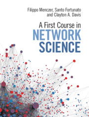

# Notes on network-science concepts and code based on ["A first course in network science"](https://cambridgeuniversitypress.github.io/FirstCourseNetworkScience/)

* Book: published January 29, 2020
* Authors: Clayton A. Davis, Santo Fortunato, Filippo Menczer
* About the book: [Google Books](https://books.google.co.kr/books/about/A_First_Course_in_Network_Science.html?id=KYHCDwAAQBAJ&source=kp_book_description&redir_esc=y)

## Contents
- 0. Introduction
- 1. Network Elements
- 2. Small Worlds
- 3. Hubs
- 4. Directions and Weights
- 5. Network Models
- 6. Communities
- 7. Dynamics

## Notes
- This repository includes my personal notes, explorations and some tests to learn the concepts and algorithms about Network Science.
- I will organize notes both in English (영어) and Korean (한국어).

---
- 2023-01-01 jkang first created